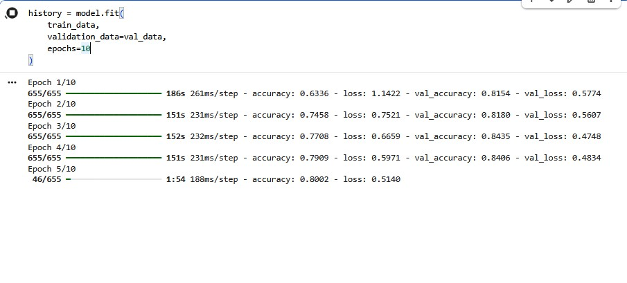
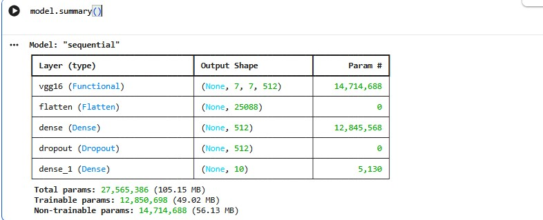
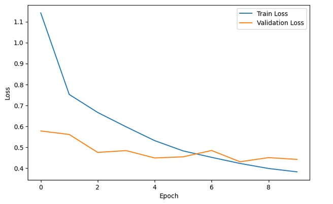
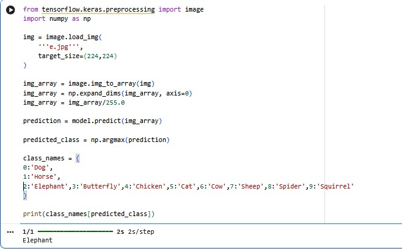

# 🐾 Animal Species Prediction using VGG16

## 📖 Description
This project uses transfer learning with the **VGG16** architecture and Deep Learning to accurately classify 10 different animal species. 

## 📊 Dataset
**Animals-10** (Kaggle Dataset)

## 🛠️ Technologies
- Python
- TensorFlow
- Keras
- VGG16

## 🎯 Performance
- **Validation Accuracy:** ~92%

## 🐕 Classes
`Dog`, `Cat`, `Horse`, `Spider`, `Butterfly`, `Chicken`, `Sheep`, `Cow`, `Squirrel`, `Elephant`

---

## 📸 Screenshots & Visuals

### 1. Data Processing & Model Summary
Here is a look at the data processing steps and the VGG16 model summary:





### 2. Training Metrics (Accuracy & Loss)
The graphs below show the model's accuracy and loss over the training epochs:

| Validation & Training Accuracy | Validation & Training Loss |
| :---: | :---: |
|  |  |

### 3. Model Output & Predictions
Testing the model with sample images to verify the predictions:




---

## ⚙️ How to Run
1. Clone this repository.
2. Install the required dependencies:
   ```bash
   pip install -r requirements.txt
